!SLIDE

# Concept 1
## Git est un gestionnaire de contenu 

!SLIDE

# Influence fortement la philosophie générale 

!SLIDE

# Comparons les backends
# «Snapshot» vs «Delta»
## (contenu vs fichier)

!SLIDE center

!SLIDE center

!SLIDE center

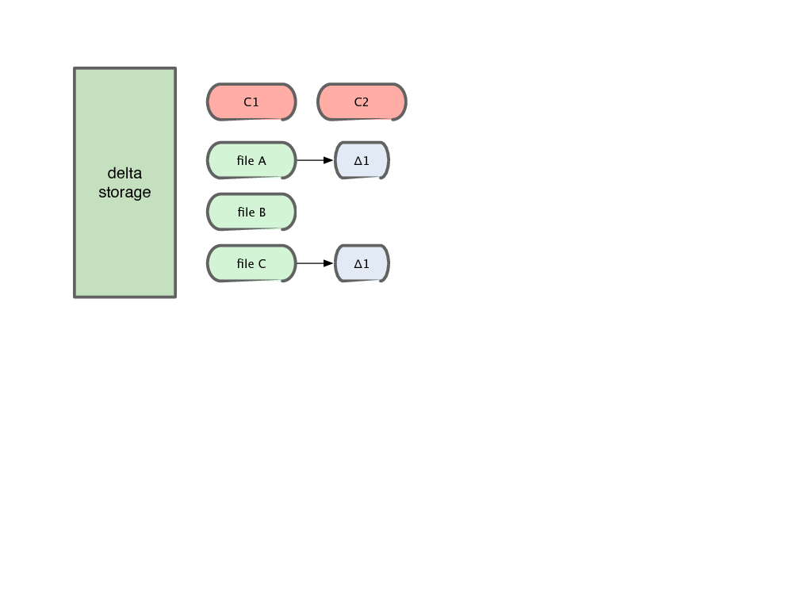

!SLIDE center

!SLIDE center

!SLIDE center

!SLIDE center

!SLIDE center

!SLIDE center

!SLIDE center

!SLIDE center

!SLIDE center

!SLIDE center

!SLIDE center

!SLIDE center

!SLIDE center

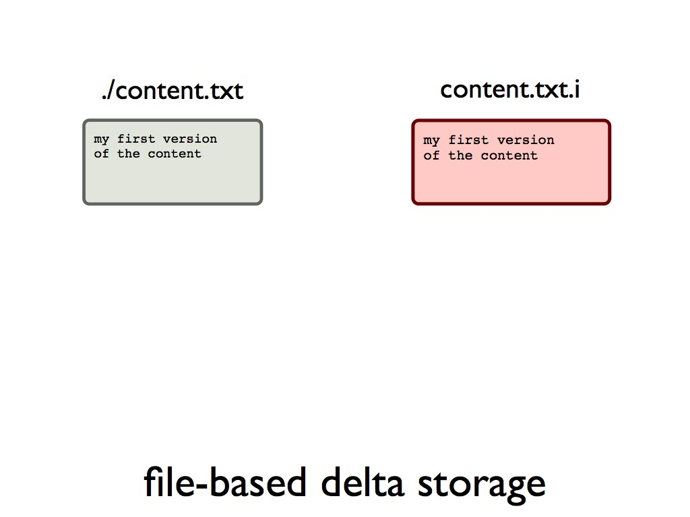

!SLIDE center

!SLIDE center

!SLIDE center

!SLIDE center

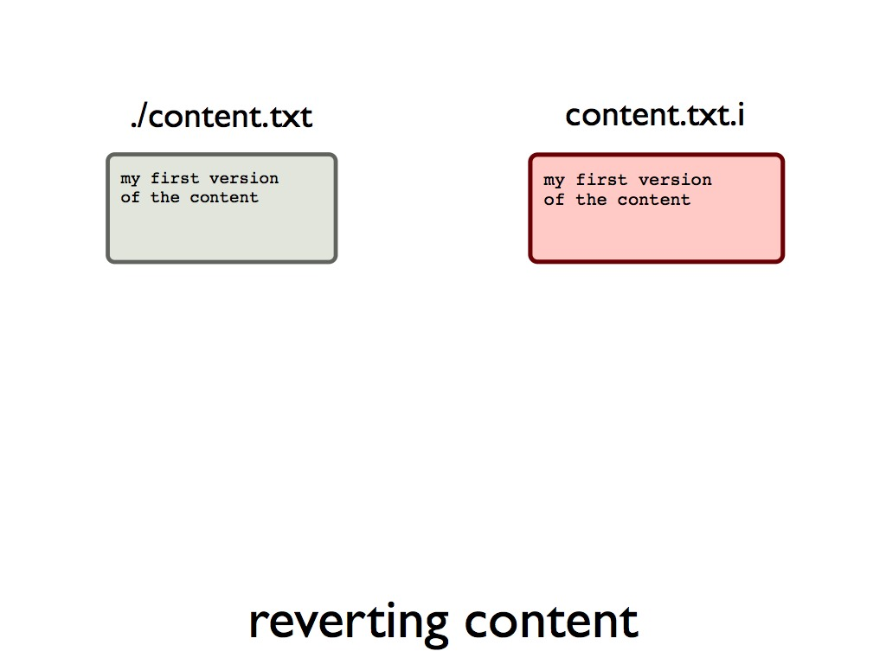

!SLIDE center

!SLIDE center

!SLIDE center

!SLIDE center

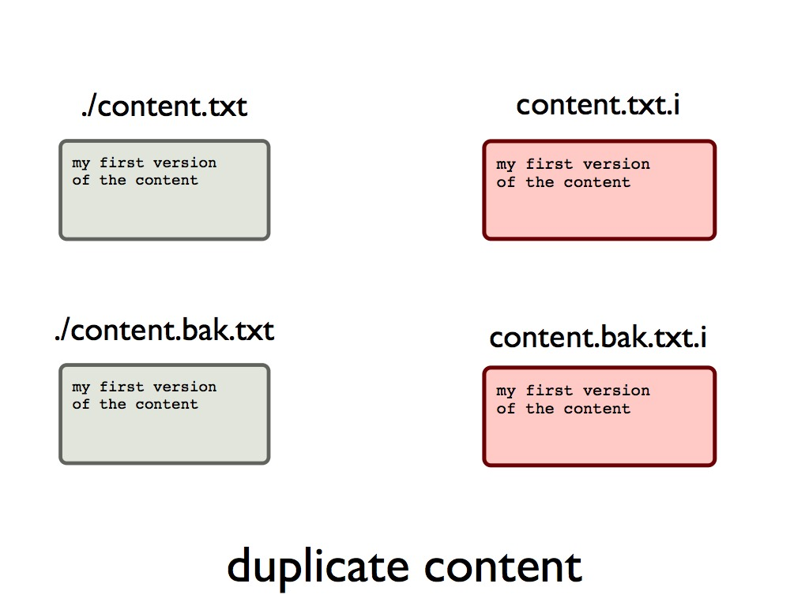

!SLIDE center

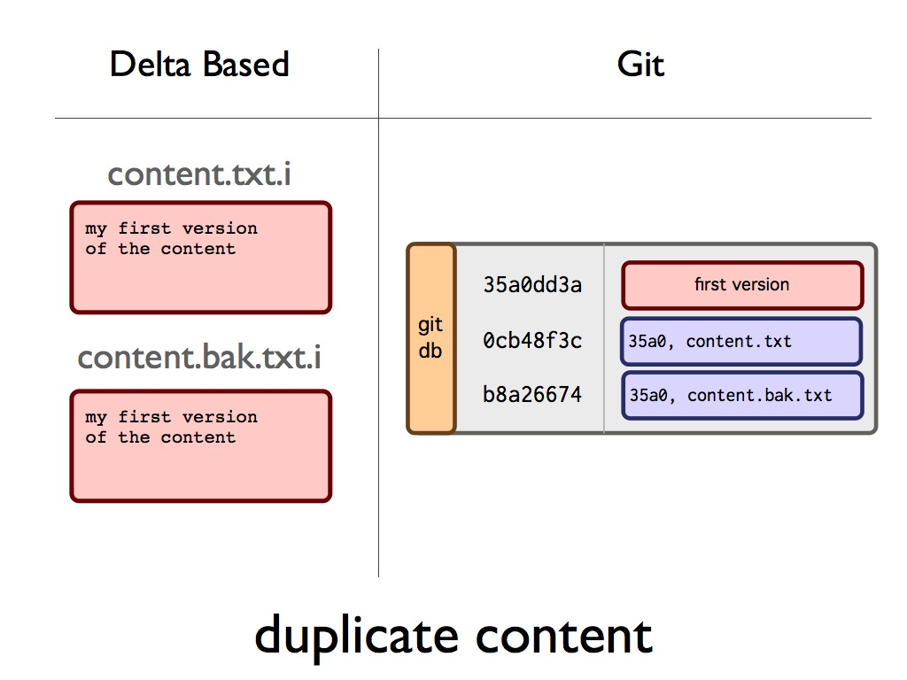

!SLIDE center

!SLIDE center

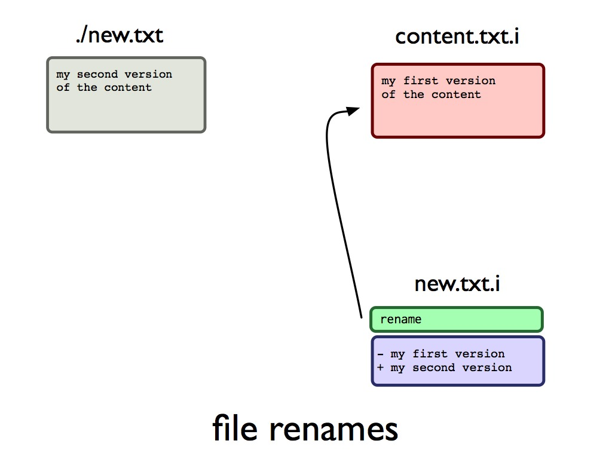

!SLIDE center

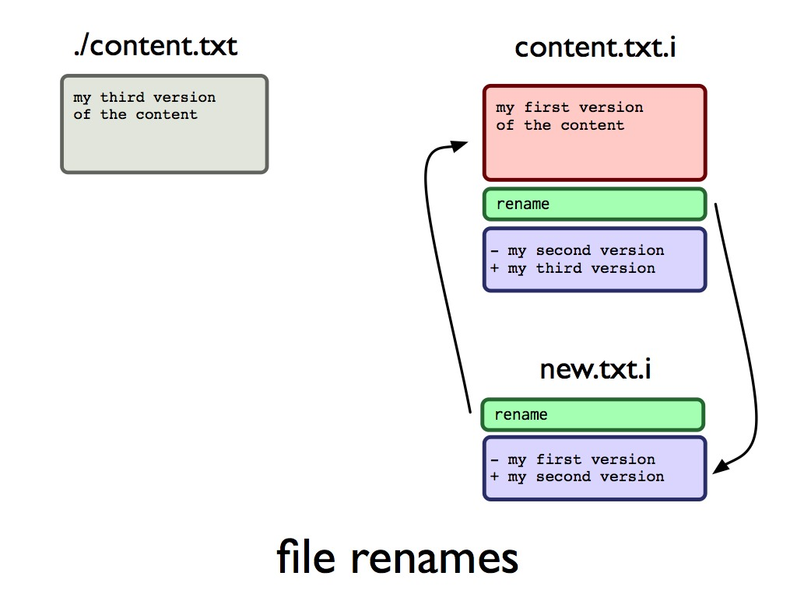

!SLIDE center

!SLIDE center

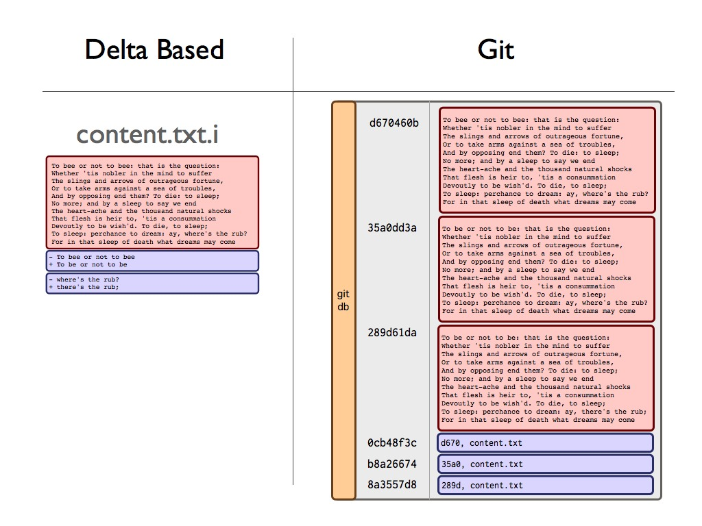

!SLIDE center

# dans une base clé / valeur ##

!SLIDE

!SLIDE center

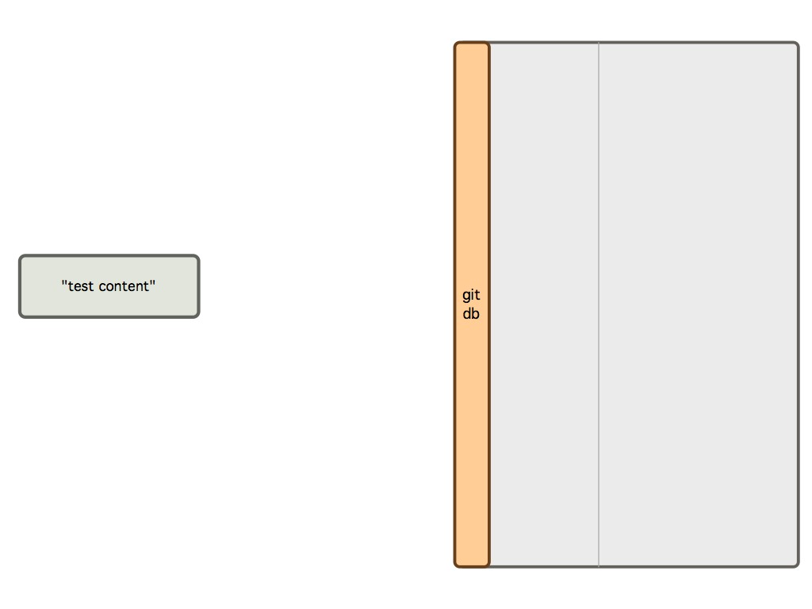

!SLIDE center

!SLIDE center

!SLIDE center

!SLIDE center

!SLIDE center

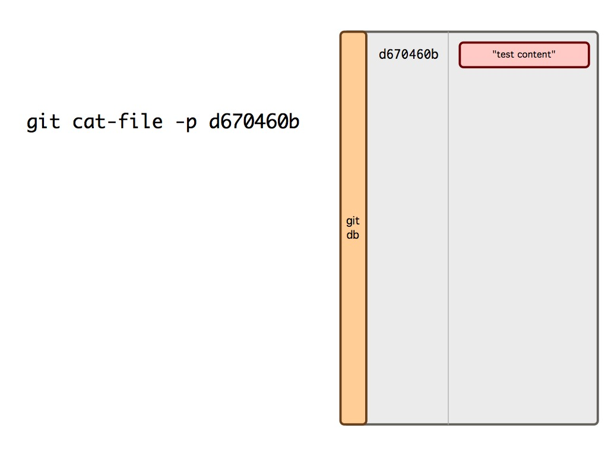

!SLIDE center

!SLIDE center

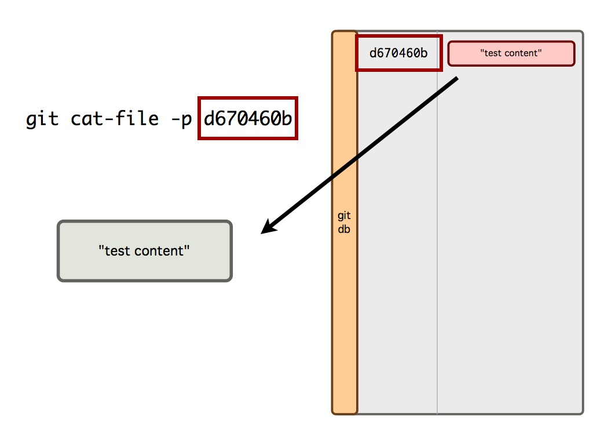

!SLIDE

# Identification par clé SHA1
## Implémentation simple et efficace

!SLIDE

## La clé est générée par une fonction de «hashage cryptographique» (SHA1) 
### SHA1(contenu) => signature sur 160 bits

!SLIDE bullets

# Avantages du SHA1

!SLIDE bullets

# Unicité
## 2^160 ou 10^48 possibilités
### (1 peta objet/s sur 1 peta an = 10^43)

!SLIDE bullets

# Facilite la comparaison

!SLIDE

# Permet de disposer de N versions d&#39;un fichier

!SLIDE

# Tout est SHA1 !

!SLIDE center

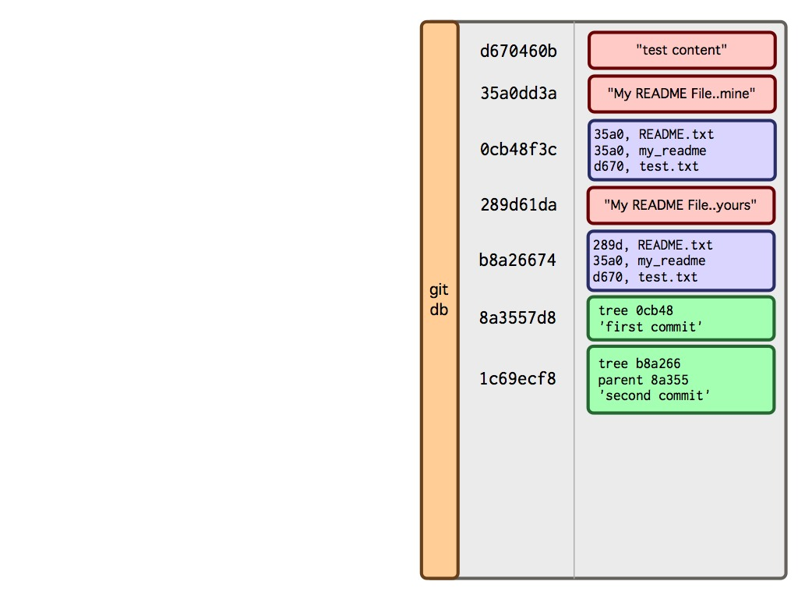

!SLIDE center

!SLIDE center

!SLIDE bullets

# Résumé du concept 1

* Orienté contenu et non fichier
* Base de données clé (sha1) / valeur
* 3 objets : commit, tree, blob
