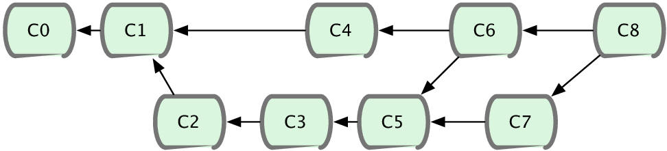
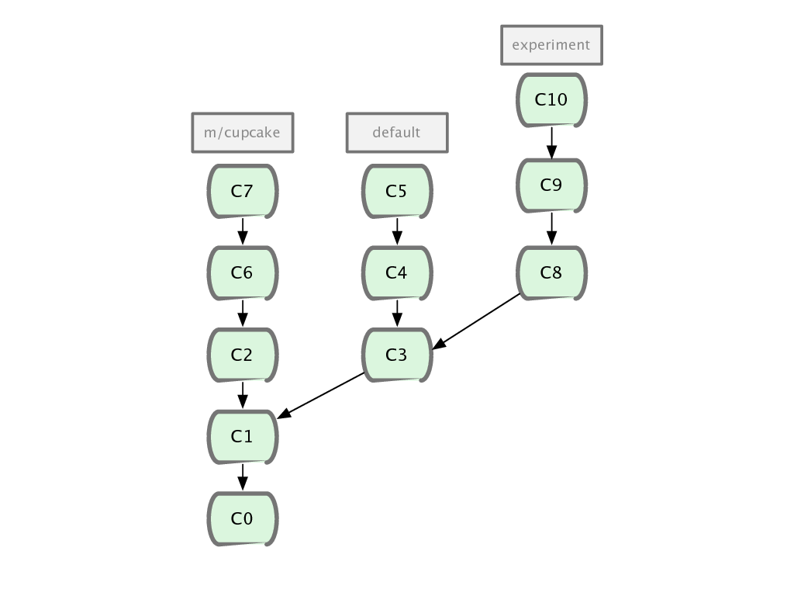
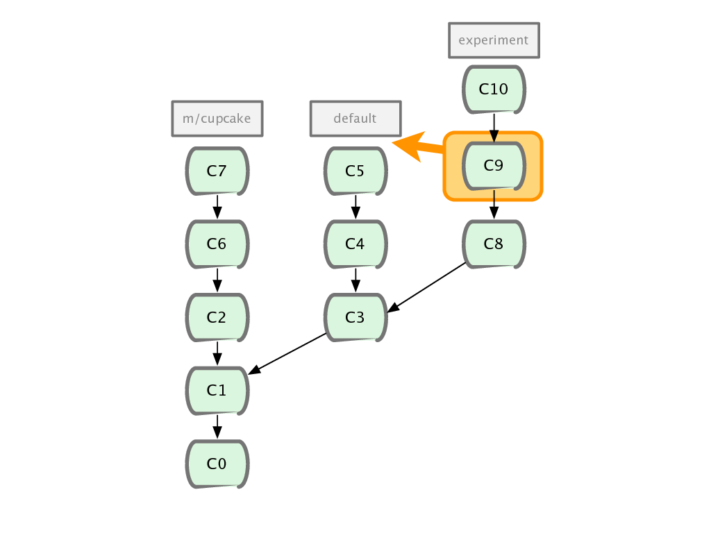

!SLIDE

# Concept 2
## La relation entre commits est un graphe acyclique (DAG)

!SLIDE

# Graphe acyclique
# =
# Graphe sans boucle

!SLIDE

# Un noeud peut avoir
# 0, 1, 2 ou N parents

!SLIDE

# Enfant -> Parent

!SLIDE center

!SLIDE bullets incremental

# Un ajout de contenu consiste à :
* Se placer sur le noeud X 
* Vouloir le contenu du noeud Y
* Appliquer une opération (X & Y)

!SLIDE 

# Les opérations : 
## commit, merge, rebase, squash, cherrypick, revert

!SLIDE

# Pour choisir l&#39;opération :
## quel graphe je veux ?

!SLIDE

# Explication par l&#39;exemple

!SLIDE

# Continuer le graphe
## Commit

!SLIDE

!SLIDE

!SLIDE

!SLIDE

# Modéliser la fusion
## Merge

!SLIDE

!SLIDE

!SLIDE

# Simplifier le graphe
## Rebase

!SLIDE

!SLIDE

!SLIDE

# Nettoyer le graphe
## Squash

!SLIDE

!SLIDE

!SLIDE

# Copie sans historique
## Cherrypick

!SLIDE

!SLIDE

!SLIDE

!SLIDE

!SLIDE

!SLIDE

# La vision chronologique n&#39;a pas de sens. La seule vision correcte est topologique.

!SLIDE bullets

# Résumé du concept 2 :

* Les commits sont reliés dans un graphe
* Manipulable à loisir
* Les objets sont immutables
