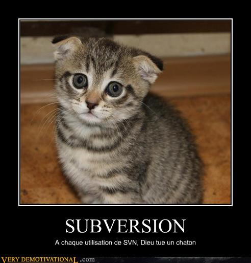

!SLIDE

# 
Sondage (5)

## Un ROTI !
### (Return of Time Invested)

!SLIDE

# 
Sondage (6)

## Qui souhaite continuer les ateliers ?

!SLIDE bullets

# Et ensuite ?
* Atelier Git initiation ?
* Atelier Git perfection ?
* Atelier Git avancé ?

!SLIDE full-page

!SLIDE

# Des questions ?
# Des remarques ?
