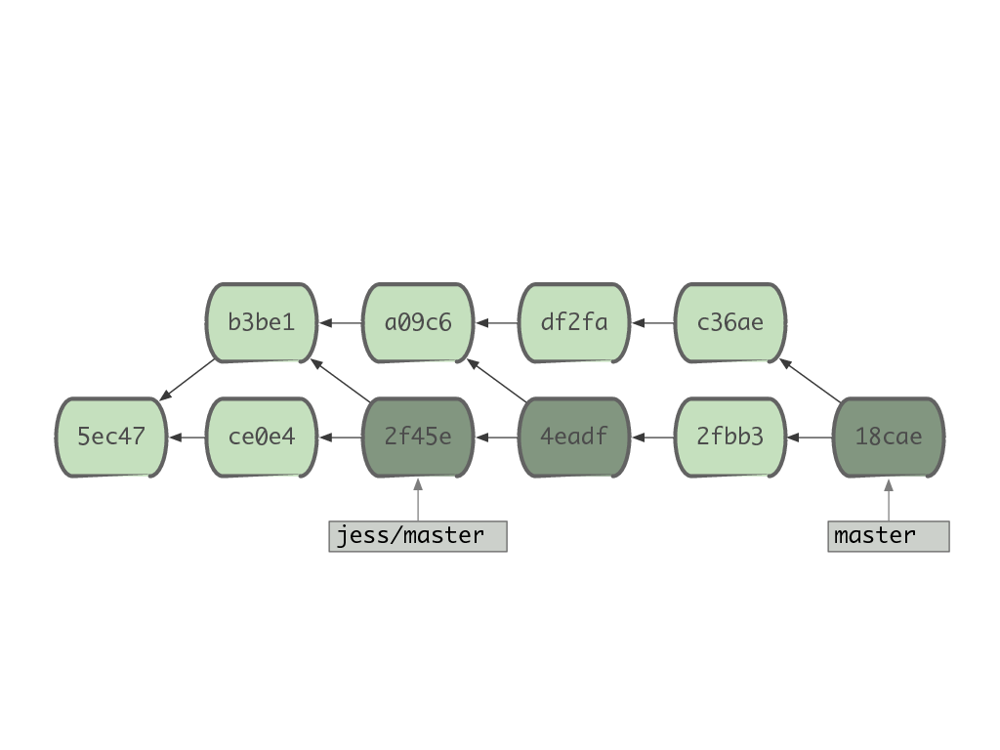
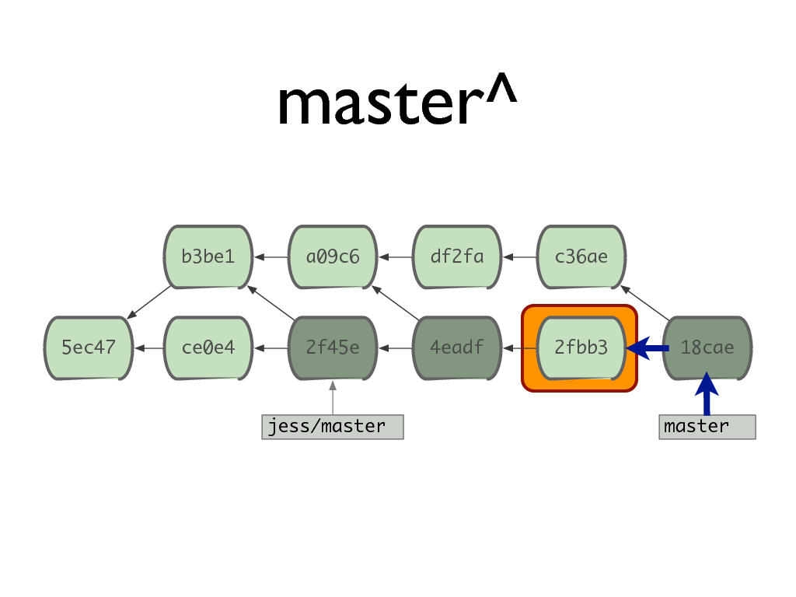
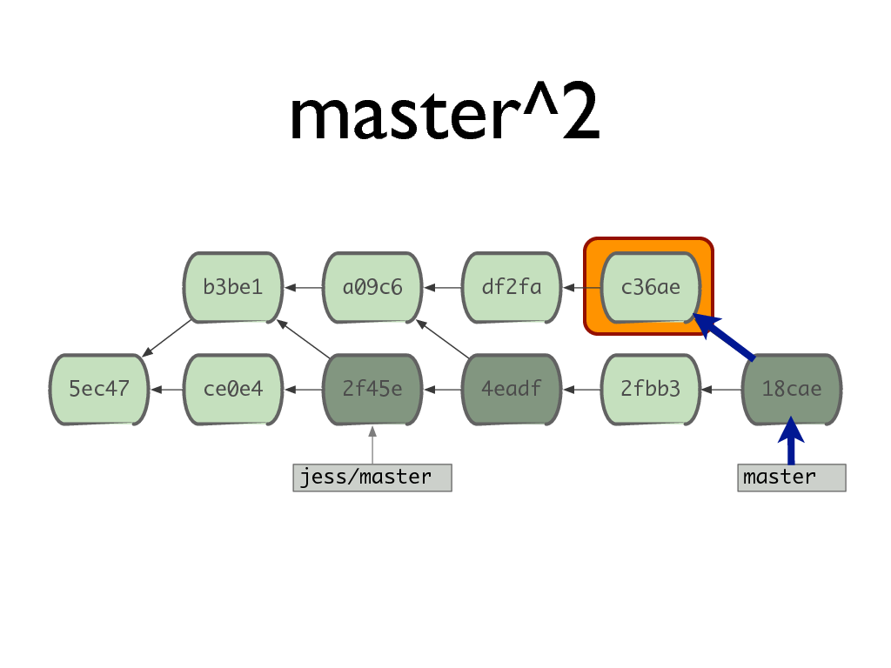
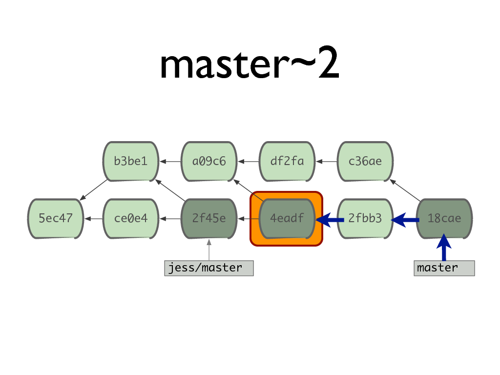
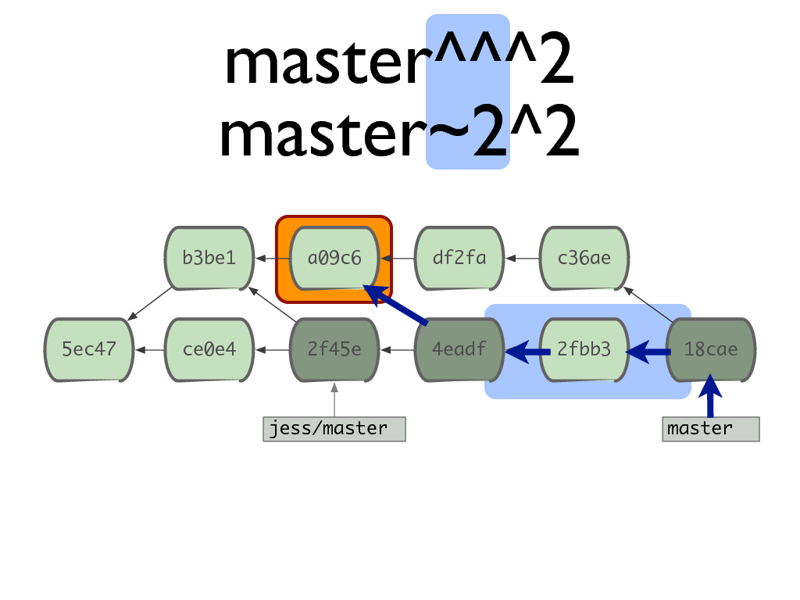
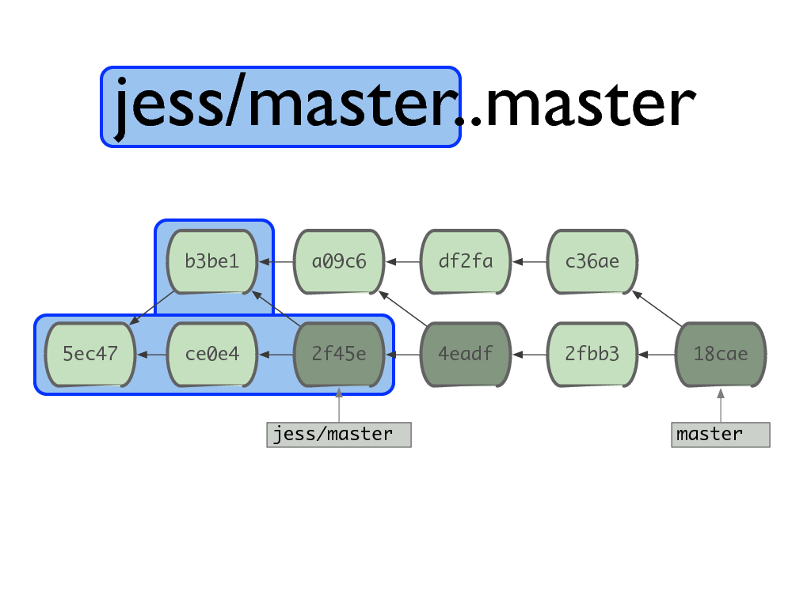
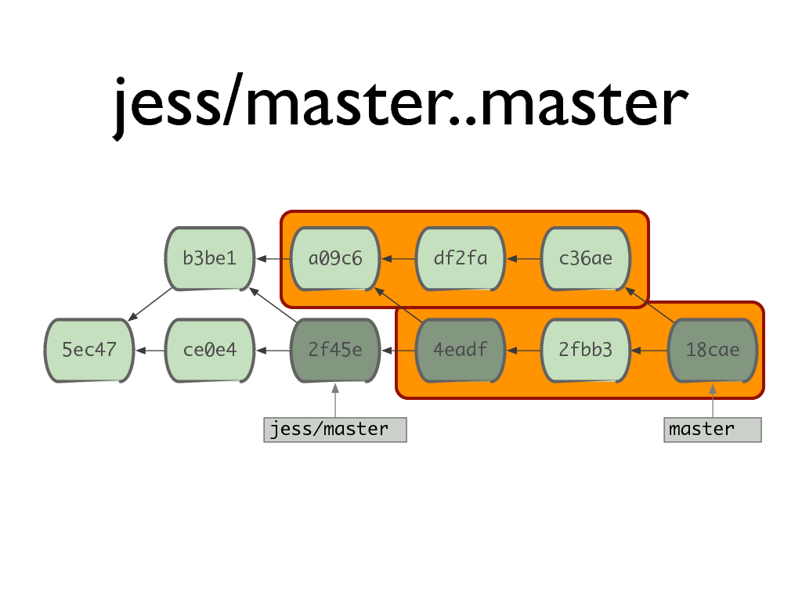
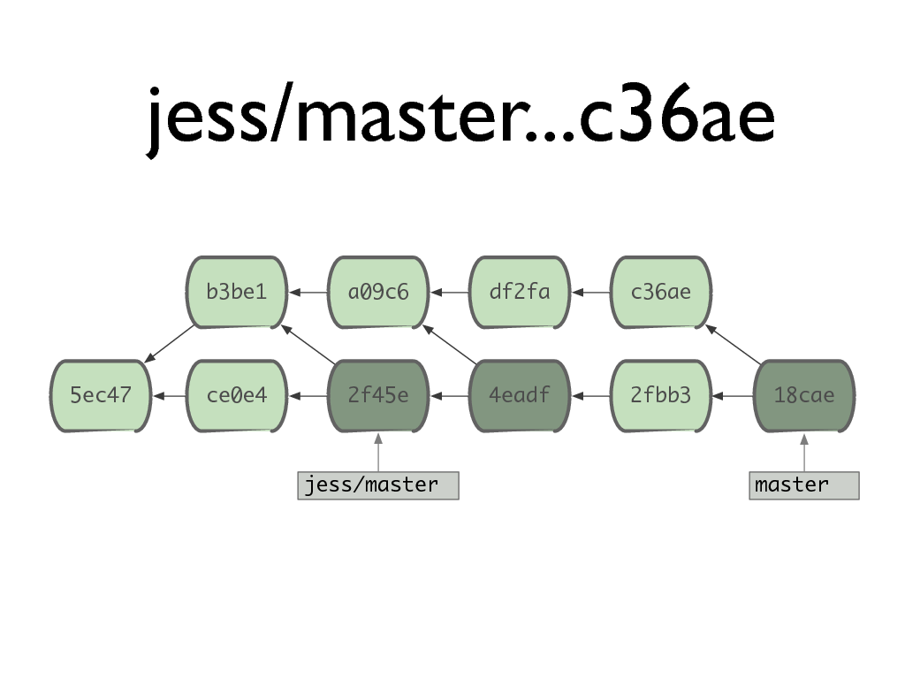
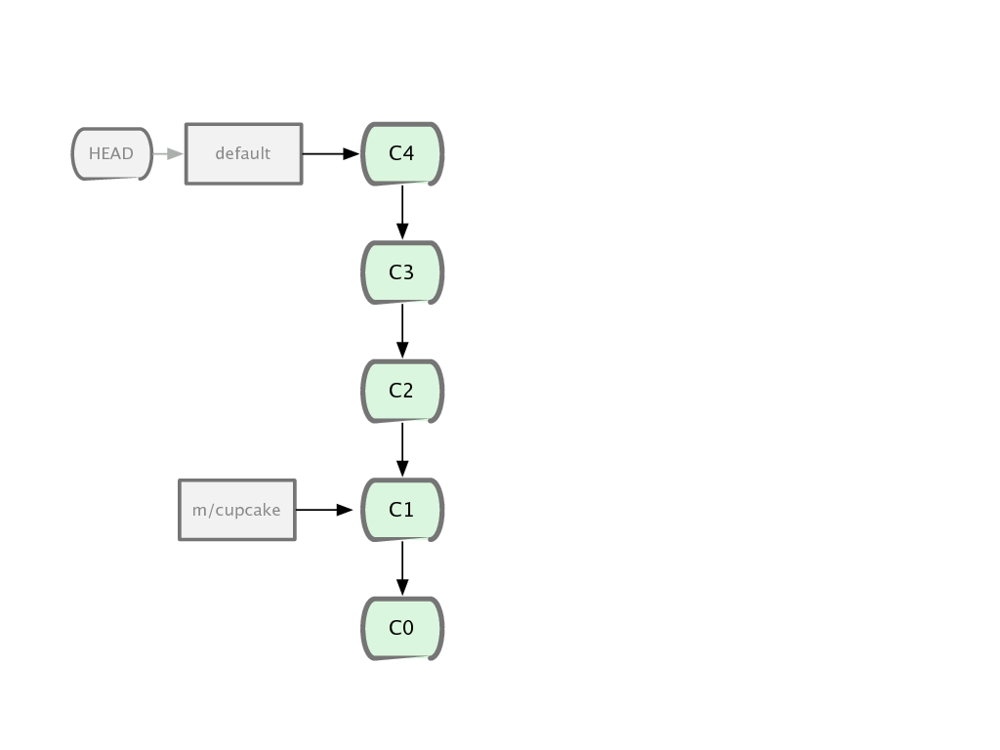

!SLIDE subsection

# Manipuler le DAG

!SLIDE

# On s&#39;appuie toujours sur les références

!SLIDE

# «Mini langage» fonctionnel

	ref^ = choix de la branche
	ref~ = distance dans la branche
	^ref = sauf la branche

!SLIDE center

!SLIDE center

!SLIDE center

!SLIDE center

!SLIDE center

!SLIDE center

!SLIDE center

!SLIDE center

!SLIDE center

!SLIDE center

!SLIDE center

!SLIDE center

!SLIDE center

!SLIDE center

!SLIDE center

!SLIDE

# Exemple

!SLIDE center

!SLIDE center

!SLIDE center

!SLIDE center

!SLIDE center

!SLIDE center

!SLIDE center

!SLIDE

# Git est à **2** dimensions

!SLIDE

# frontend (ref)
# /
# backend (DAG)

!SLIDE

# Plus **puissant** mais aussi plus **complexe**
