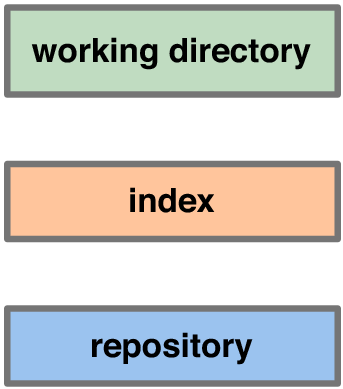

!SLIDE

## 145 commandes
### 37 commandes Porcelain (13 régulières)

!SLIDE

## commande de base : 13
### init / merge / clone / remote / add
### fetch / commit / push / branch
### checkout / add / log / diff

!SLIDE commandline

## On se déplace dans le graphe `git co` 

	$ git co master

	$ time git co e83c516
	real	0m0.181s
	user	0m0.080s
	sys	0m0.100s

	$ git glog -n 1
	* e83c516 - (HEAD) Initial revision...

!SLIDE center

## Index : staging (optionnel)

!SLIDE

# Le *fast forward* est un merge dont une branche est le déscendant de l&#39;autre

!SLIDE center

!SLIDE center

!SLIDE

## Sauvegarder son travail dans un espace temporaire
### La commande stash

!SLIDE 

## Un exemple de modification du passé
### option --amend
