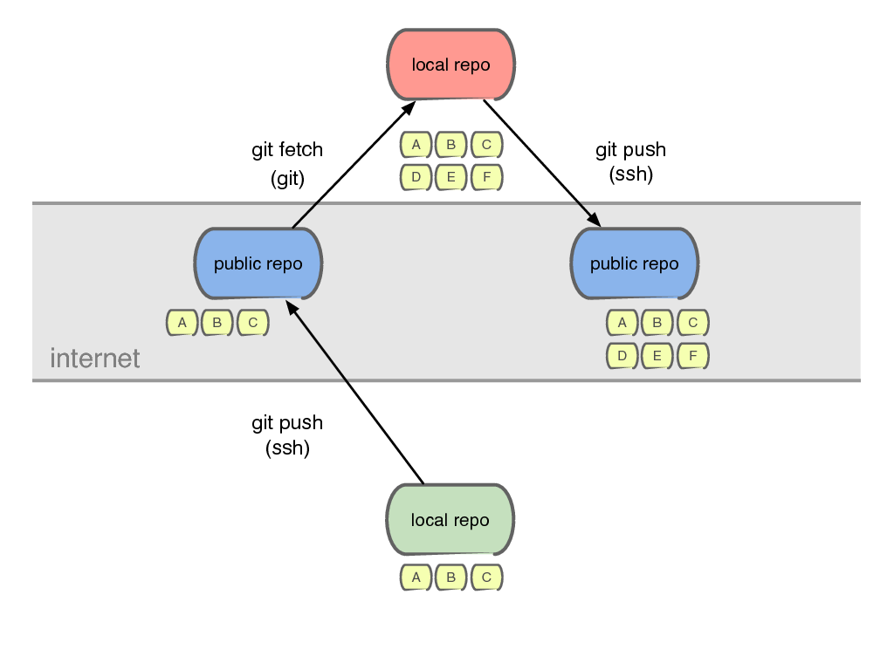
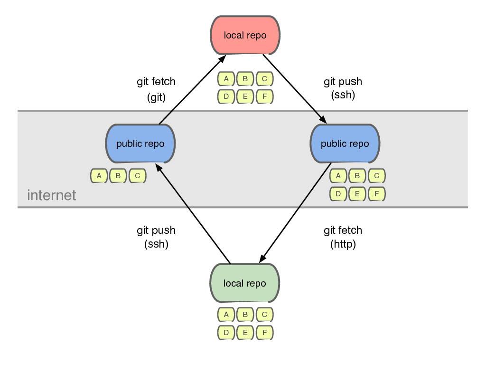
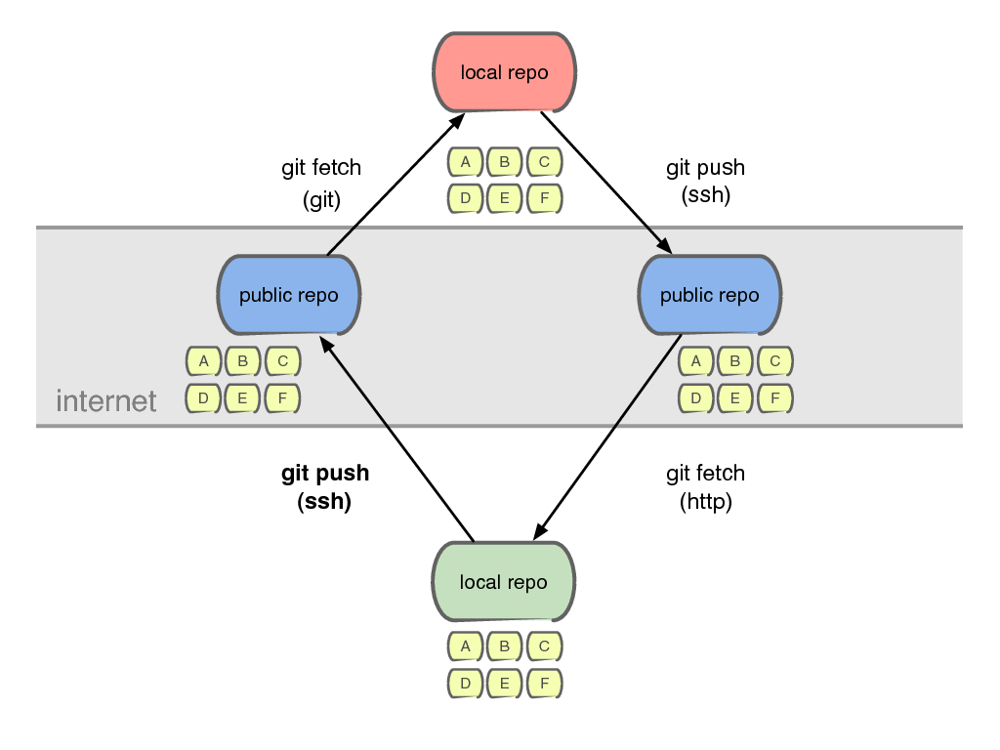
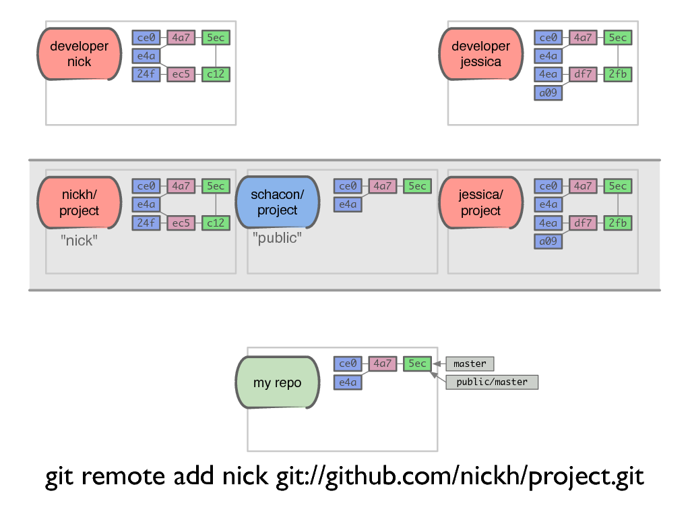
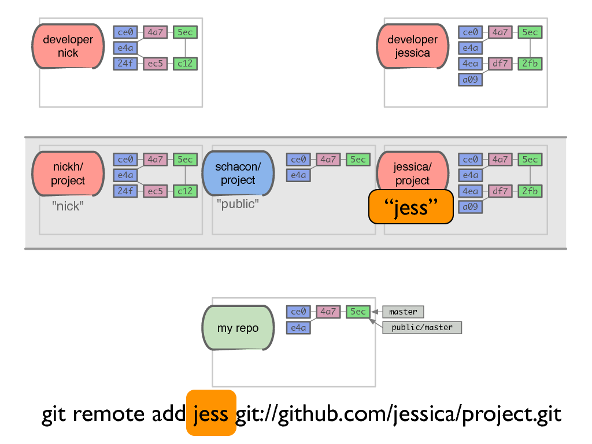
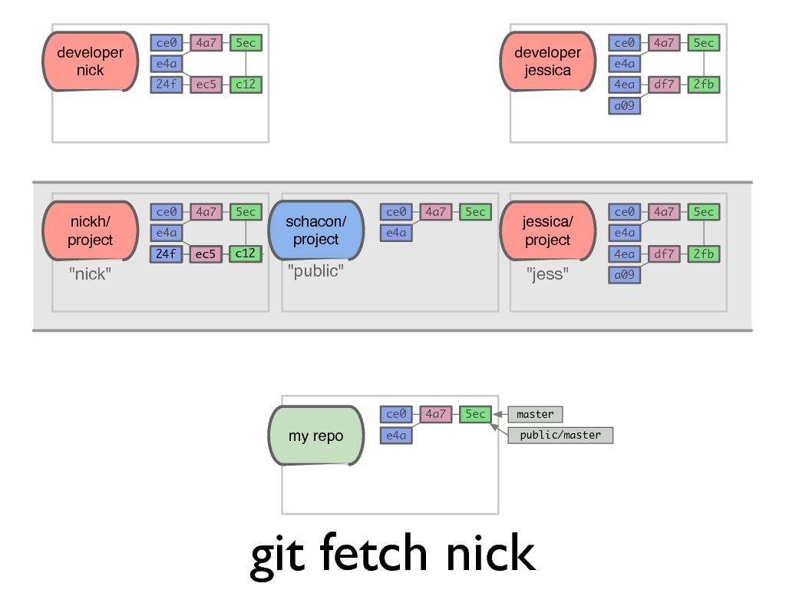
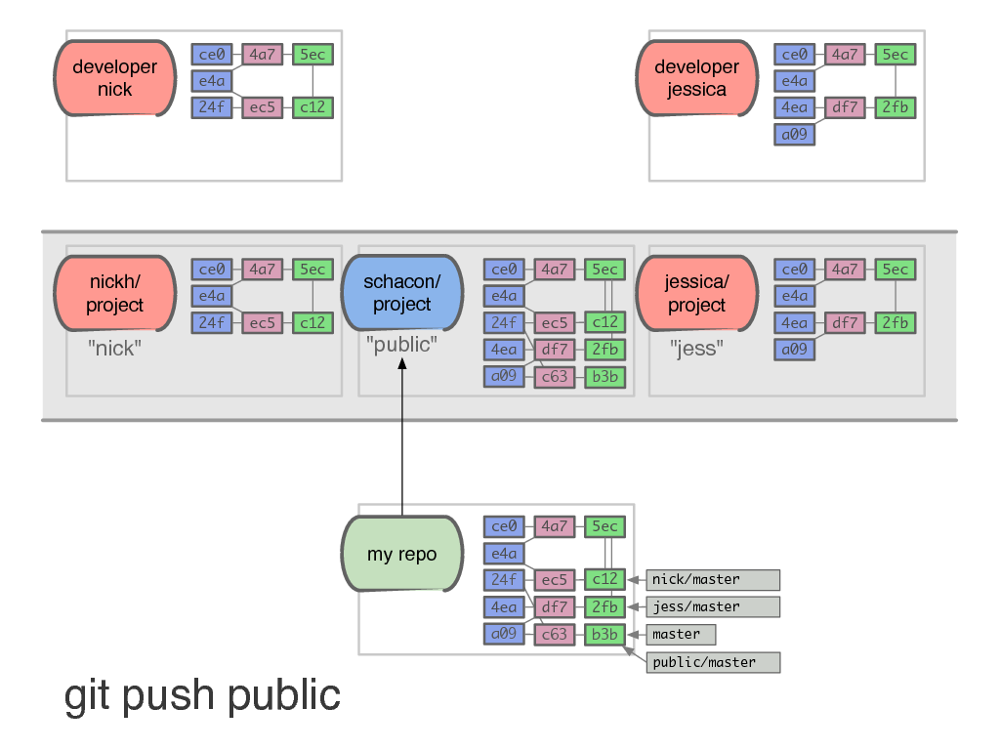
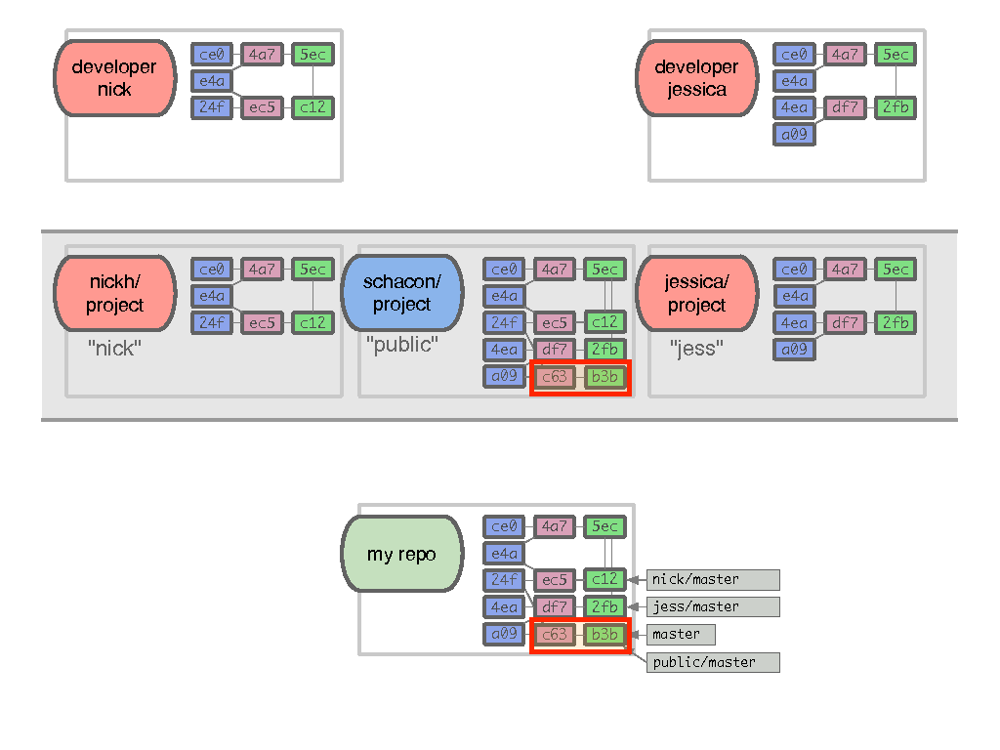
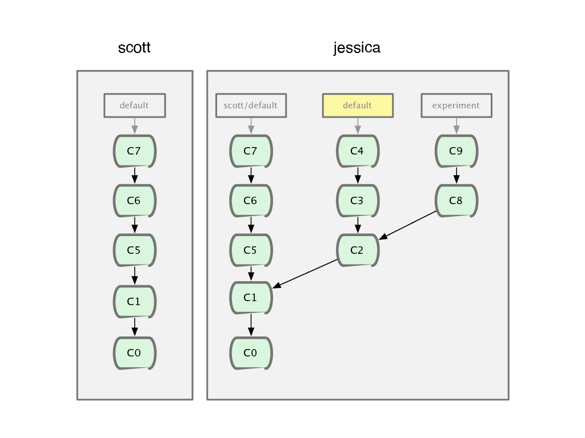

!SLIDE subsection

# Collaboration

!SLIDE

# Git est un gestionnaire de contenu "synchronisable" 

!SLIDE

## La collaboration dans Git se résume...

!SLIDE 

## à copier des objets entre les dépôts

!SLIDE

# 2 manières de collaborer

!SLIDE

## Je vais récupérer du code chez mon voisin (**fork**) et je lui dit quand il peut venir chercher les modifications (**pull request**).

!SLIDE

!SLIDE center

!SLIDE center

!SLIDE center

!SLIDE center

!SLIDE center

!SLIDE center

!SLIDE center

!SLIDE 

# Un exemple plus intéressant
## La notion de «remote»

!SLIDE center

!SLIDE center

!SLIDE center

!SLIDE center

!SLIDE center

!SLIDE center

!SLIDE center

!SLIDE center

!SLIDE center

!SLIDE center

!SLIDE center

!SLIDE center

!SLIDE center

!SLIDE center

!SLIDE center

!SLIDE center

!SLIDE center

!SLIDE center

!SLIDE center

!SLIDE center

!SLIDE center

!SLIDE center

!SLIDE center

!SLIDE center

!SLIDE

# Les «remotes» sont des branches

!SLIDE center

!SLIDE center

!SLIDE center

!SLIDE center

!SLIDE center

!SLIDE center

!SLIDE center

!SLIDE center

!SLIDE center

!SLIDE center

!SLIDE center

!SLIDE center

!SLIDE center

!SLIDE center

!SLIDE center

!SLIDE commandline

## Dépôt partagé (pas de .git)

	$ mkdir monrepo
	$ cd monrepo
	$ git clone --bare -s monrepo
