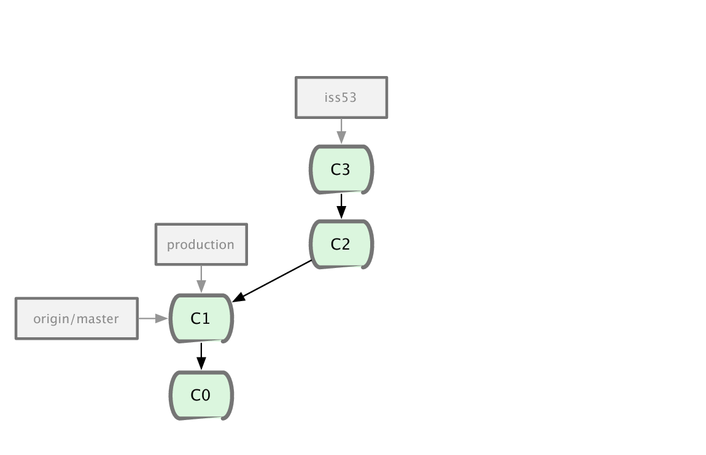

!SLIDE

# Concept 3
## Le contenu est accessible sous forme de référence

!SLIDE

# Pouvez vous mémoriser un SHA1 ?
### e83c5163316f89bfbde7d9ab23ca2e25604af290

!SLIDE

# Ou même ?
### e83c516

!SLIDE

# Quel est le SHA1 ?

!SLIDE commandline

## Comparable au DNS

	$ host google.fr
	google.fr has address 209.85.229.99

!SLIDE commandline

## Une référence pointe sur un commit

	$ cat .git/refs/master
	e83c5163316f89bfbde7d9ab23ca2e25604af290

!SLIDE

# 2 types de références :
## déplacée par Git
## déplacée par l&#39;utilisateur

!SLIDE center

## Exemple de déplacement automatique

!SLIDE center

## Exemple de déplacement automatique

!SLIDE center

## Exemple de déplacement automatique

!SLIDE

## Un nom de branche est une référence
### (placé par l&#39;utilisateur et déplacée par git)

!SLIDE commandline

## git branch newbranch

	$ cat .git/refs/heads/newbranch
	e83c5163316f89bfbde7d9ab23ca2e25604af290

!SLIDE

!SLIDE

## Une branche (concept frontend) n&#39;est donc qu&#39;une référence vers un noeud du graphe. Cad un fichier de 40 octets. 

!SLIDE commandline

## Voila la raison du **cheap branching**

	$ time git checkout -b newbranch
	Switched to a new branch 'newbranch'

	real    0m0.012s
	user    0m0.000s
	sys     0m0.000s

!SLIDE

# un tag léger est une référence #
## (déplacée par l&#39;utilisateur) ##

!SLIDE commandline

##  git tag v1.2 e83c516

	$ cat .git/refs/tags/v1.2
	e83c5163316f89bfbde7d9ab23ca2e25604af290

!SLIDE bullets

# Résumé du concept 3 :
* Utile seulement pour l&#39;utilisateur
* Une référence est un pointeur (un post-it)
* Un simple fichier de 40 octets
* Possible car chaque commit représente le projet tout entier
