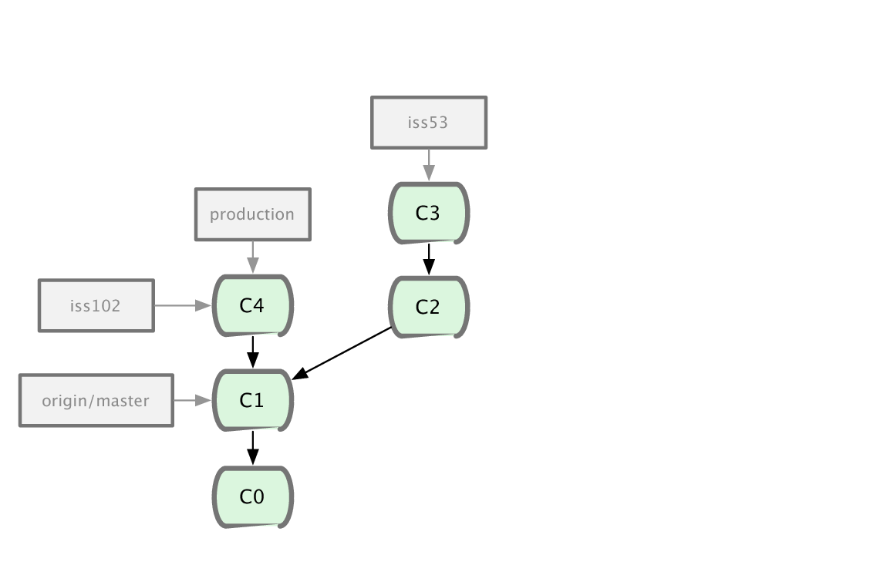

!SLIDE subsection

# Usage

!SLIDE

## 145 commandes / 37 Porcelain
### 13 régulières :
### init / merge / clone / remote / add
### fetch / commit / push / branch
### checkout / add / log / diff

!SLIDE commandline

## Le contenu du .git

	$ tree
	|-- branches
	|-- config
	|-- description
	|-- HEAD
	|-- hooks
	|-- info
	|   `-- exclude
	|-- objects
	|   |-- info
	|   `-- pack
	`-- refs
	    |-- heads
	    `-- tags

!SLIDE center

!SLIDE commandline

## Rapide !

	$ git checkout master

	$ time git checkout e83c516
	real    0m0.181s
	user    0m0.080s
	sys     0m0.100s

	$ git glog -n 1
	* e83c516 - (HEAD) Initial revision...

!SLIDE center

## Index : staging (optionnel)

!SLIDE

# Le *fast forward* est un merge dont une branche est la déscendante de l&#39;autre

!SLIDE center

!SLIDE center

!SLIDE

## Sauvegarder son travail dans un espace temporaire
### La commande stash

!SLIDE 

## Autre exemple de modification du passé
### option --amend

!SLIDE

# Des options intéressantes à Diff
## --patience
## -C
## -M
