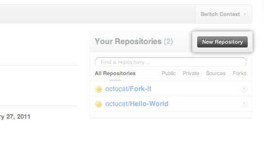
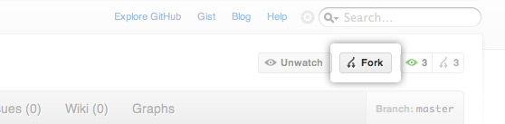
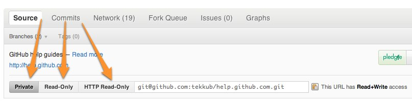
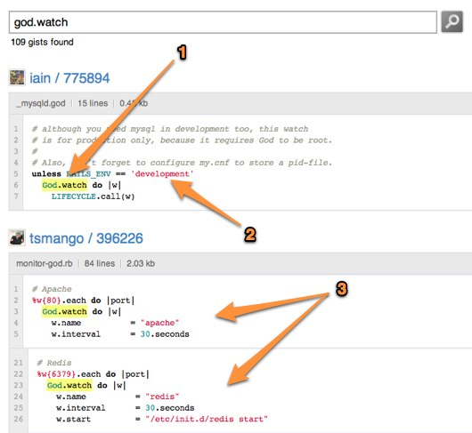
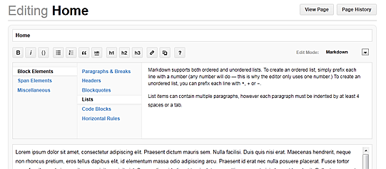
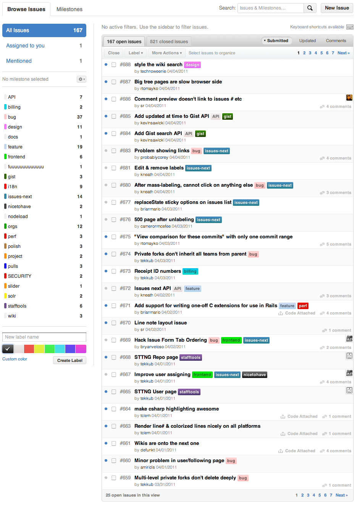
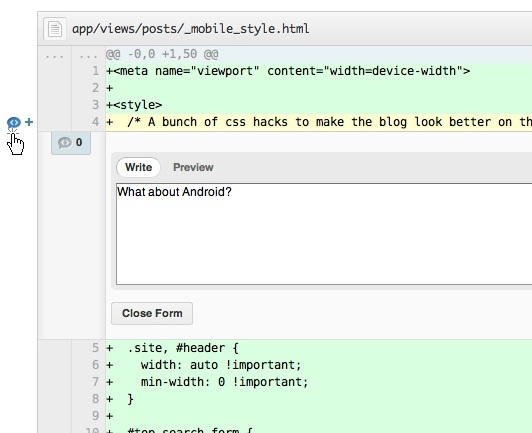
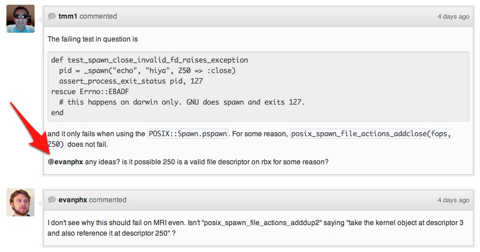

!SLIDE subsection

# GitHub

!SLIDE bullets

# Simplicité collaborative

!SLIDE center

## Nouveau dépôt

## fork d&#39;un dépôt

!SLIDE center

## Récupération 

!SLIDE center

## Gist

!SLIDE center

## wiki

!SLIDE center

## Bugtracker

!SLIDE center

## Revue de code

!SLIDE center

## Discussion

!SLIDE bullets

# Outils ligne de commande :
* https://github.com/defunkt/github-gem
* https://github.com/schacon/git-pulls

!SLIDE center

# Le «social coding»

