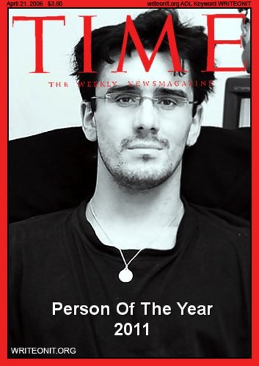
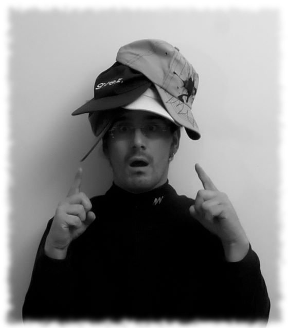
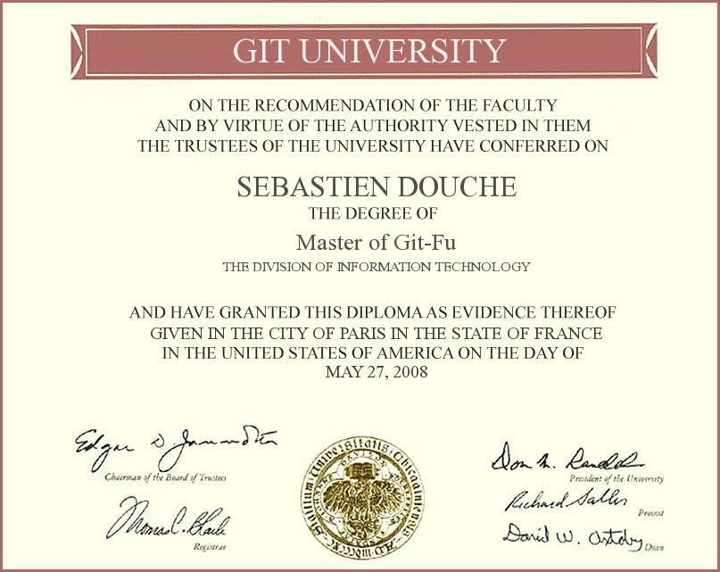
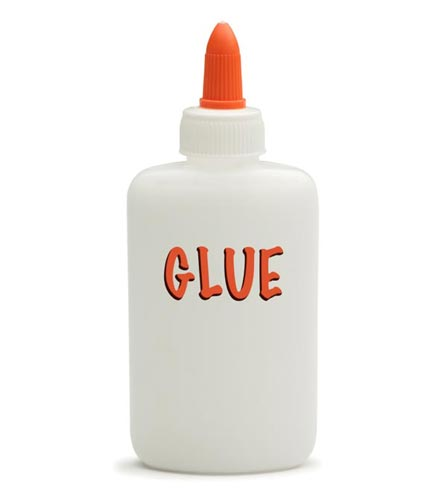
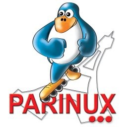
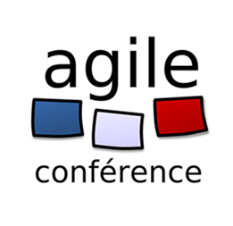
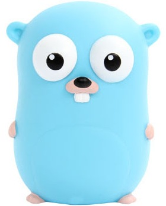
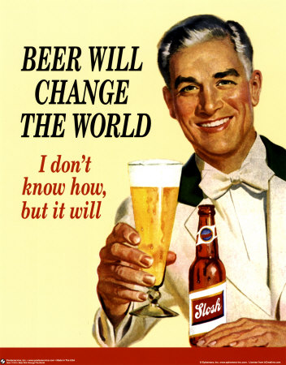

!SLIDE

# &lt;me&gt;

!SLIDE center

!SLIDE center

!SLIDE center

!SLIDE center

!SLIDE center

!SLIDE

# Directeur Technique

!SLIDE

# Responsable R&D

!SLIDE center

!SLIDE

# Admin (système, réseau)

!SLIDE

# Devops

!SLIDE

# Release Manager

!SLIDE center

!SLIDE center

!SLIDE 

# Coach

!SLIDE

# objectif
## rendre une organisation efficace

!SLIDE

# Lifehacking
## (Mindmap, GTD, Pomodoro...)

!SLIDE center

!SLIDE center 

!SLIDE center 

!SLIDE

# @sdouche

!SLIDE 

# seb@gitfr.net

!SLIDE

# Je n'ai rien à vous vendre

!SLIDE center

# &lt;/me&gt;
