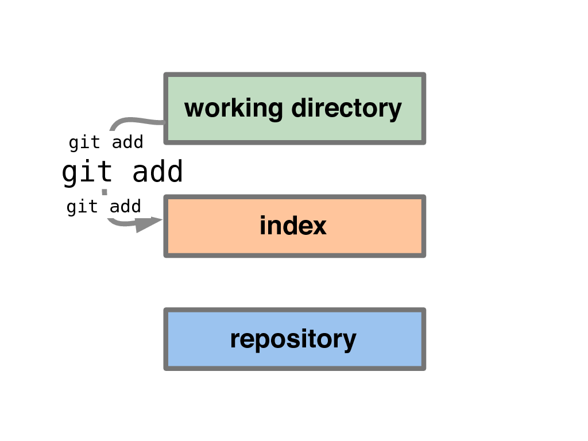

!SLIDE subsection

# Usage

!SLIDE

## 150 commandes / 76 Porcelain
### 37 principales
### 14 manipulations
### 16 interrogations
### 9 intéractions

!SLIDE

## 9 régulières :
### status / merge / checkout
### commit / reset / rebase / diff
### pull / push

!SLIDE

# Je construis mon commit **progressivement** :
# l&#39;index

!SLIDE center

!SLIDE center

!SLIDE commandline 

# Ajout par hunk

	$ git add -p

!SLIDE center

!SLIDE center

!SLIDE center

!SLIDE center

!SLIDE center

!SLIDE center

!SLIDE commandline

# Sauvegarder son travail

	$ git stash
	Saved working directory and index state...

!SLIDE commandline

# Récupération
	$ git stash branch b1
        Switched to a new branch...

!SLIDE commandline

# Modifier le dernier commit

	$ git commit --amend

!SLIDE commandline

# Retrouver un bug manuellement

	$ git bisect start

	$ git bisect bad master

	$ git bisect good v2.6.18

!SLIDE commandline

# ou automatiquement

	$ git bisect run my_script arguments
