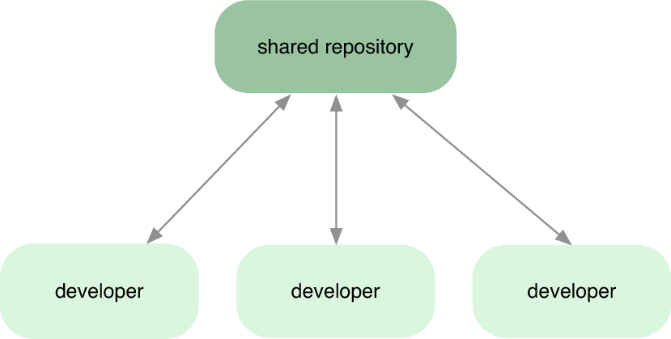
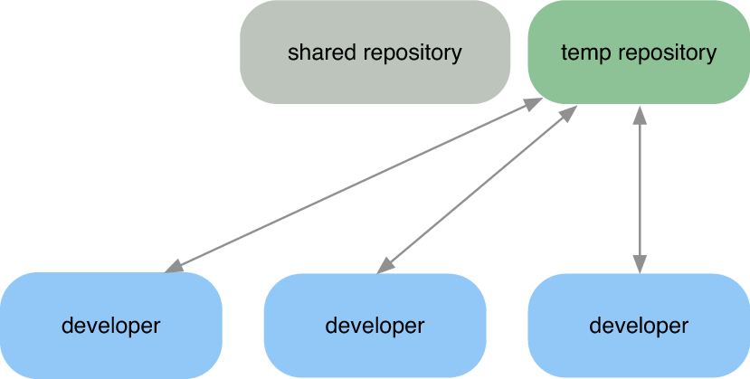
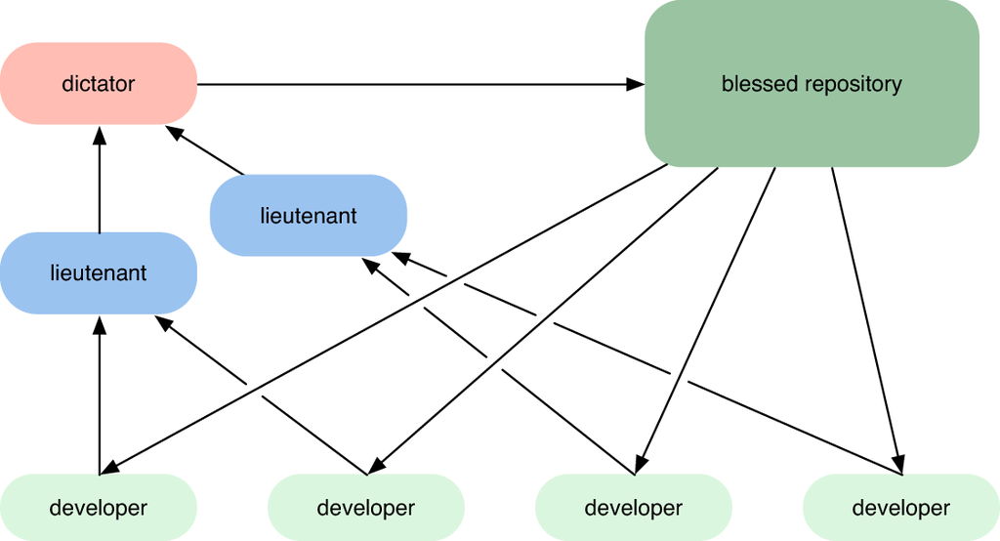
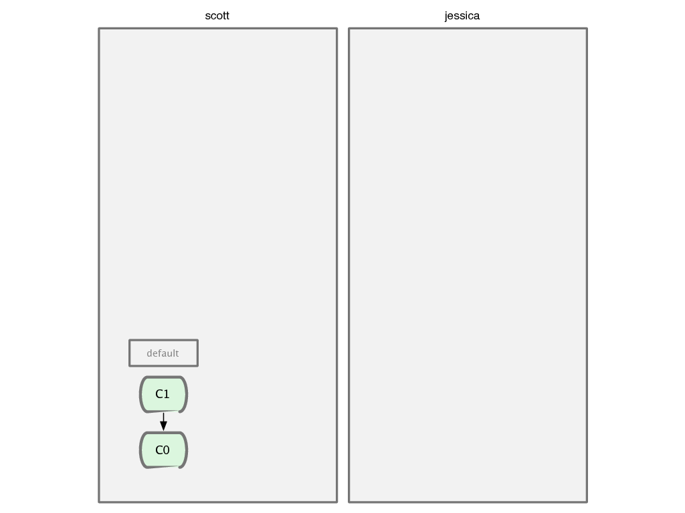
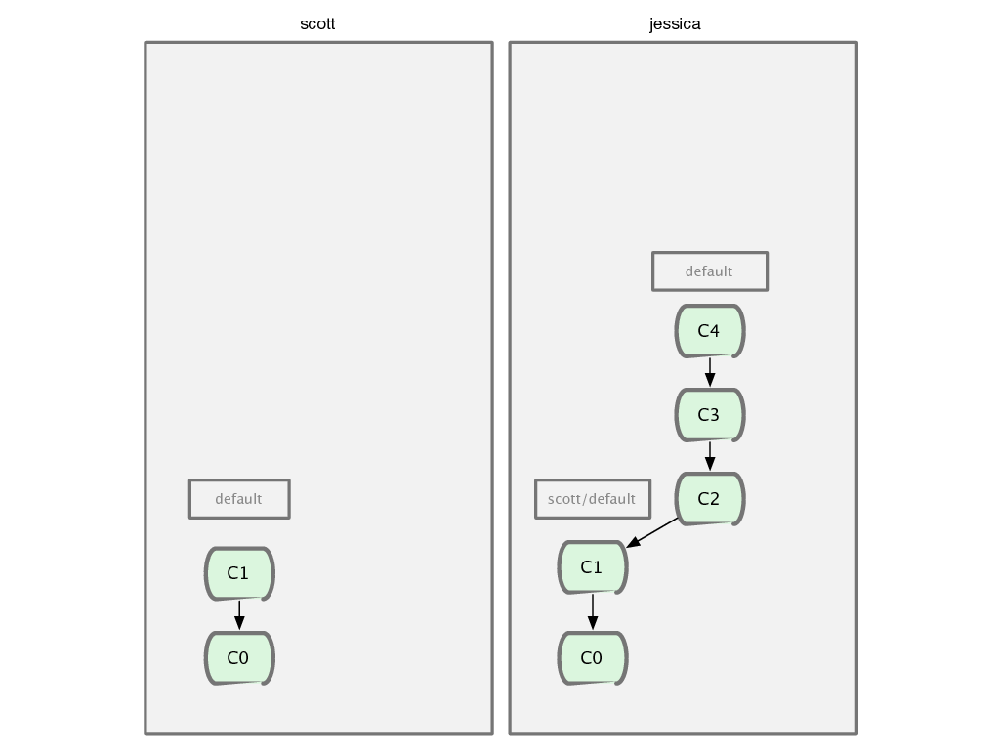
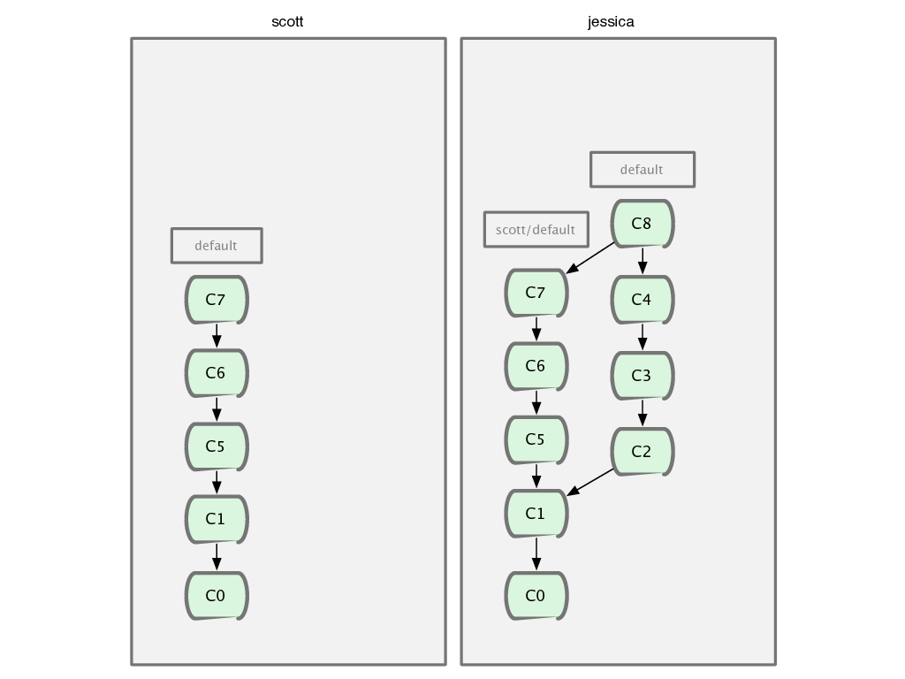
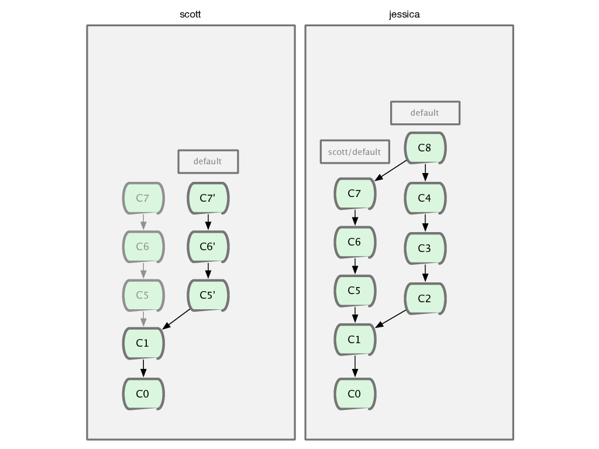
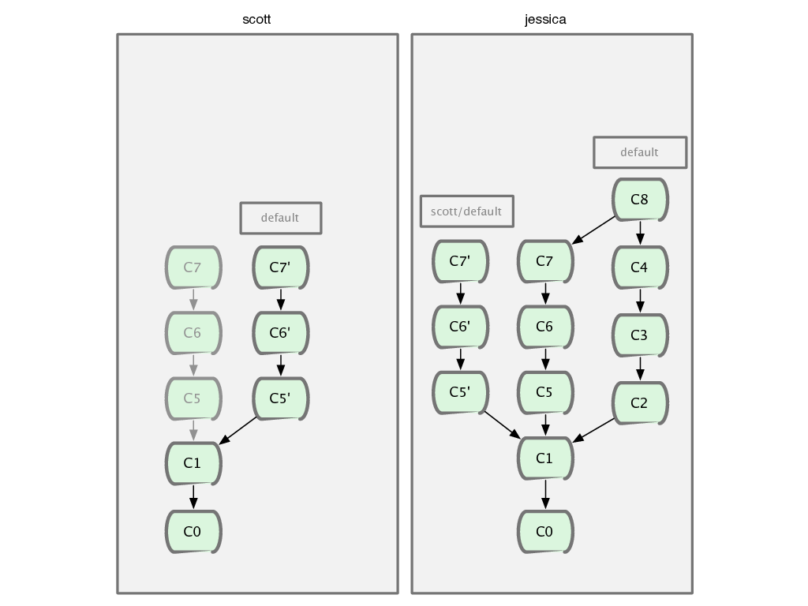
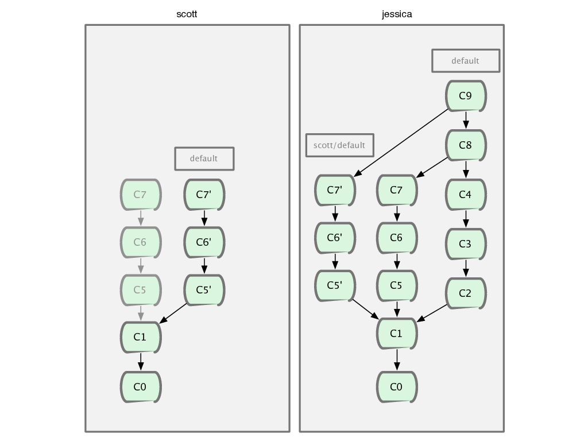

!SLIDE subsection

# Workflows

!SLIDE

# La notion de référenciel est **sociale**, pas technique

!SLIDE center

# Plusieurs méthodes de travail

!SLIDE center

!SLIDE center

!SLIDE center

!SLIDE center

!SLIDE center

!SLIDE center

# Ne pas modifier l&#39;historique aprés publication

!SLIDE center

!SLIDE center

!SLIDE center

!SLIDE center

!SLIDE center

!SLIDE center

!SLIDE center

!SLIDE center

# Git ne possède pas d&#39;ACL

!SLIDE bullets

# Il existe :
* des hooks
* des serveurs
* paramètre de configuration
